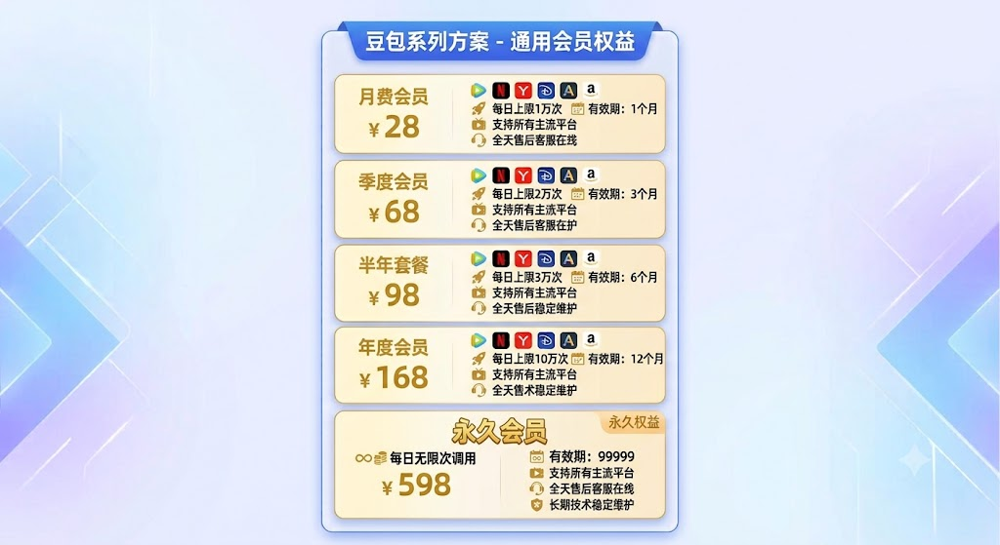

# 豆包去水印解决方案

本项目用于展示豆包 `thread` 与 `video-sharing` 链接解析能力的技术验证成果，定位为豆包去水印、豆包视频解析、豆包无水印视频下载相关解决方案。当前方案已完成可用性验证，可稳定识别分享链接中的视频或图片内容，并输出统一结构化结果。

> 说明：本文档仅用于成果展示和商务沟通，不公开任何实现细节、逆向过程、接口路径或核心算法。

## 核心优势

- 完全不依赖第三方解析平台
- 不经过第三方中转服务器
- 返回豆包原始资源直链
- 视频、封面、图片均为源站直链结果
- 链路更短，延迟更低，稳定性更可控
- 适合私有化部署和生产系统集成

## 验证结论

- `thread` 链接解析：已验证成功
- `video-sharing` 链接解析：已验证成功
- 无水印视频地址提取：已验证成功
- 图片资源提取：已验证成功
- 视频封面提取：已验证成功
- 豆包原始直链返回：已验证成功
- 无第三方依赖解析链路：已验证成功
- Go SDK 集成：已验证成功
- Python SDK 接入：支持
- JavaScript / Node.js SDK 接入：支持
- macOS / Linux / Windows 跨平台编译：已验证成功

## 有效性验证展示

| 验证项目 | 验证结果 | 展示说明 |
|----------|----------|----------|
| 分享链接识别 | 有效 | 可识别豆包 `thread` 与 `video-sharing` 分享链接 |
| 视频资源解析 | 有效 | 可返回豆包原始视频直链与封面直链 |
| 图片资源解析 | 有效 | 可返回豆包原始图片直链数组 |
| 统一结构化输出 | 有效 | 可输出标准 `code/msg/data` 结果结构 |
| SDK 集成验证 | 有效 | Go SDK 已完成集成验证，Python 与 Node.js 可提供接入 |
| 跨平台运行验证 | 有效 | macOS、Linux、Windows 环境均已验证 |

## 支持能力

### 视频结果

可解析并返回：

- 豆包原始无水印视频直链
- 豆包原始视频封面直链
- 原始分享链接
- 标题或提示词信息
- 视频大小
- 稳定唯一 ID

### 图片结果

可解析并返回：

- 豆包原始图片直链数组
- 原始分享链接
- 标题或提示词信息
- 稳定唯一 ID

### 统一输出

所有解析结果统一返回 `code/msg/data` 结构，方便接入业务系统、后台服务或自动化流程。

成功示例：

```json
{
  "code": 0,
  "msg": "ok",
  "data": {
    "type": "video",
    "videoUrl": "https://example.com/video.mp4",
    "imageUrls": [
      "https://example.com/cover.png"
    ],
    "videoUrls": [
      "https://example.com/video.mp4"
    ],
    "watermarkUrl": "https://www.doubao.com/thread/...",
    "title": "视频标题或提示词",
    "videoSize": 123456,
    "uniqueId": "unknown:..."
  }
}
```

## 多语言 SDK 支持

方案核心能力可封装为多种 SDK，方便不同技术栈项目接入。

当前支持或可提供：

- Go SDK
- Python SDK
- JavaScript / Node.js SDK
- HTTP API 私有化封装
- CLI 命令行工具
- 按业务系统定制接入

## 集成方式

方案可作为独立命令行工具使用，也可以作为 SDK 或 HTTP API 集成到业务项目中。

整个解析流程不依赖第三方平台，不需要将链接提交到外部解析服务。业务侧拿到的是豆包资源直链，便于直接下载、入库、缓存或接入现有素材处理系统。

推荐生产集成方式：

- 直接通过 SDK 调用
- 通过 HTTP API 调用私有化服务
- 使用 `context.Context` 控制超时和取消
- 对分享链接做短期缓存
- 控制并发请求量
- 不记录 cookie、视频直链等敏感信息

## 跨平台支持

| 平台 | 状态 |
|------|------|
| macOS arm64 | 已验证 |
| Linux x86_64 | 已验证 |
| Linux arm64 | 已验证 |
| Windows | 已验证 |

## 适用场景

- 内容解析能力验证
- 私有化工具集成
- 内部素材处理流程
- 自动化内容归档
- 授权内容下载与管理
- 二次开发和定制接入

## 不公开内容

为保护方案稳定性和安全性，以下内容不对外公开：

- 核心解析逻辑
- 逆向分析过程
- 请求细节
- 加密或解码细节
- 风控规避方式
- 内部接口路径

如需演示、接入或定制开发，可通过联系方式沟通。

## 主流平台会员权益

以下内容为主流平台会员权益补充展示，不属于上方“豆包去水印解决方案”的技术验证结论、接口能力或交付范围。



| 套餐 | 价格 | 调用额度 | 有效期 | 平台支持 | 服务支持 |
|------|------|----------|--------|----------|----------|
| 月费会员 | ¥28 | 每日上限 1 万次 | 1 个月 | 支持所有主流平台 | 全天售后客服在线 |
| 季度会员 | ¥68 | 每日上限 2 万次 | 3 个月 | 支持所有主流平台 | 全天售后客服在线 |
| 半年套餐 | ¥98 | 每日上限 3 万次 | 6 个月 | 支持所有主流平台 | 全天售后稳定维护 |
| 年度会员 | ¥168 | 每日上限 10 万次 | 12 个月 | 支持所有主流平台 | 全天售后稳定维护 |
| 永久会员 | ¥598 | 每日无限次调用 | 99999 | 支持所有主流平台 | 全天售后客服在线，长期技术稳定维护 |

### 全平台 SEO 关键词

以下关键词为全平台检索信息，不属于上方豆包去水印技术方案正文。

- 豆包去水印
- 豆包视频去水印
- 豆包视频解析
- 豆包无水印视频下载
- 抖音去水印
- 抖音视频去水印
- 抖音无水印解析
- 抖音无水印视频下载
- 快手去水印
- 快手视频去水印
- 快手无水印解析
- 快手无水印视频下载
- 视频号去水印
- 微信视频号去水印
- 视频号无水印解析
- 视频号无水印视频下载
- 小红书去水印
- 小红书视频去水印
- 西瓜视频去水印
- 皮皮虾去水印
- B 站视频解析
- 主流短视频平台去水印
- 短视频无水印解析
- 视频链接解析接口
- 视频解析 API
- 无水印视频下载接口
- 私有化视频解析服务
- 多平台视频解析 SDK
- 短视频素材采集
- 视频素材归档

## 联系方式

- 微信：u99391
- 最佳沟通时间：当天（以实际联系日期为准）

## 合规说明

本项目仅用于技术研究、学习交流和内部验证场景，不用于商业盈利。

使用者应确保拥有相关内容的合法使用权，并遵守目标平台服务条款及当地法律法规。请勿将本项目用于任何侵权、违规或未经授权的用途。
